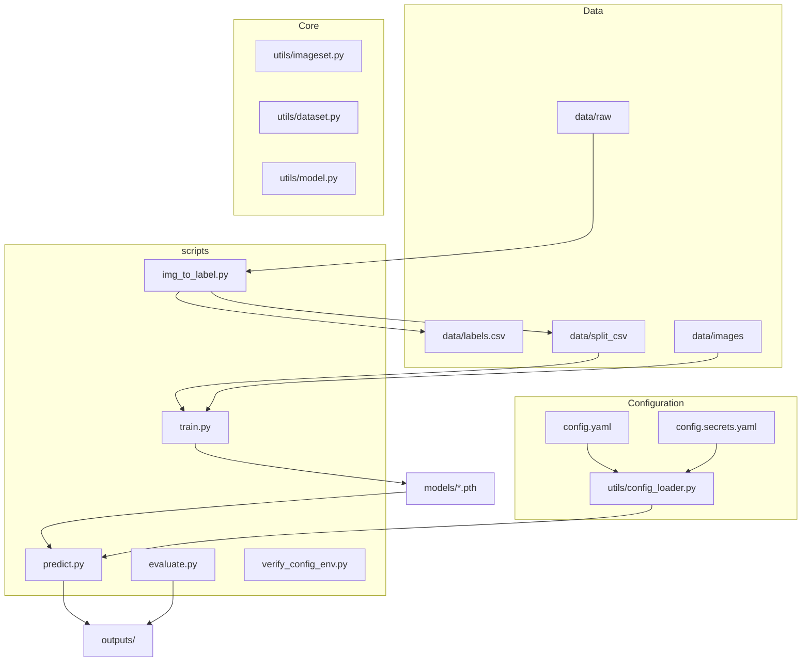
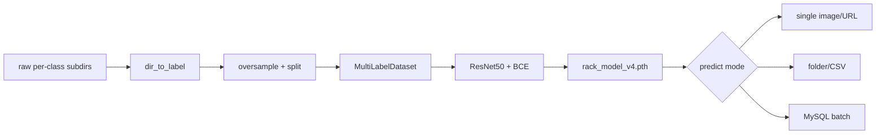

**Language / 语言:** [English](README.md) | [简体中文](README.zh-CN.md)

# cv-shelf-classification

**Multi-label image classification** for retail / store-visit **shelf visit photos**. A single image may contain multiple labels at once (e.g. combinations of `RC`, `RP`, `other`), not mutually exclusive single-class classification. Built with PyTorch + torchvision (ResNet50 by default), scikit-learn metrics, and optional MySQL write-back for predictions.

Typical pipeline: **raw directory labels → dataset split → train → evaluate/ROC → production batch inference**. Training, evaluation, and prediction scripts live under [`scripts/`](scripts/); core logic is in [`utils/`](utils/). `predict.py` loads config via [`utils/config_loader.py`](utils/config_loader.py), while `train.py`, `evaluate.py`, and `img_to_label.py` still use the relative path `../config.yaml` — **run those scripts from the `scripts/` directory**.

---

## Why use this project

- **Multi-label + class imbalance**: [`utils/imageset.py`](utils/imageset.py) supports `oversample_minority` and `compute_pos_weight_from_csv`; training uses `BCEWithLogitsLoss(pos_weight=...)` to mitigate positive/negative imbalance.
- **End-to-end script chain**: `img_to_label.py` → `train.py` → `predict.py` → `evaluate.py`, with parameters centralized in [`config.yaml`](config.yaml).
- **Production integration**: `predict_from_mysql()` fetches pending records from business tables, builds image URLs via `build_resource_url()`, runs batch inference, and writes JSON results back (see [`scripts/predict.py`](scripts/predict.py) ~lines 109–227).
- **Multi-environment config**: development / testing / production; MySQL passwords are not committed — inject via `config.secrets.yaml` or `RACK_MYSQL_PASSWORD`.
- **Reproducible evaluation**: `evaluate.py` outputs a classification report and `outputs/roc_curve.png`.

---

## Architecture

### Modules and directories



### Training and inference data flow



---

## How it works

### Labeling and data

`dir_to_label` scans `data/raw/<class>/` subdirectories and writes [`data/labels.csv`](data/labels.csv). `split_dataset` produces `train.csv`, `val.csv`, and `test.csv` under `data/split_csv/`, and can copy test images. During training, [`MultiLabelDataset`](utils/dataset.py) applies random flips, rotation, and `ColorJitter` augmentation.

### Model and loss

[`MultiLabelClassifier`](utils/model.py) replaces the backbone’s final layer with `num_classes` outputs; the forward pass applies Sigmoid for probabilities. The training script uses `BCEWithLogitsLoss` on raw logits (optionally with `pos_weight`); validation F1 selects the best checkpoint, saved to `model.save_path` in `config.yaml` (default `models/rack_model_v4.pth`).

### Inference and thresholds

At inference, apply `sigmoid` to logits, then compare against `predict_threshold` (default **0.6** in `config.yaml`) for binary labels. MySQL batch mode connects via `get_mysql_connect_kwargs()` for the active environment and updates prediction fields per your business schema.

---

## Quick start

### Environment and install

```bash
cd /path/to/rack_multilabel   # replace with your clone path
pip install -r requirements.txt
cp config.secrets.example.yaml config.secrets.yaml   # required for local MySQL
```

> **Note**: `requirements.txt` ends with an editable install line `-e g:\www\python_www\rack_clean_multilabel`. Adjust the path for your machine or remove that line before installing.

### Data prep → train → evaluate

Run the following from the **`scripts/`** directory:

```bash
cd scripts

# 1) Generate labels from raw, oversample, split, copy test set
python img_to_label.py

# 2) Train (weights written to model.save_path in config)
python train.py

# 3) Predict on test set (uncomment predict_from_csv in predict.py __main__)
python predict.py   # default: single-image demo; batch modes below

# 4) Evaluate + ROC (requires outputs/test_predictions.csv)
python evaluate.py
```

### Prediction modes

Four entry points in [`scripts/predict.py`](scripts/predict.py) `__main__`:

| Mode | Description | Example |
|------|-------------|---------|
| Single image/URL | Default entry | `python predict.py` |
| Folder | `predict_folder` | Uncomment: `predict_folder("../data/images_test")` |
| CSV | `predict_from_csv` | Uncomment: `predict_from_csv("../data/split_csv/test.csv")` |
| MySQL | `predict_from_mysql` | Set `RACK_MYSQL_PASSWORD`; uncomment: `predict_from_mysql()` |

For environment variables, MySQL passwords, and local config checks, see [Configuration](#configuration) below.

---

## Scripts reference

| Script | Purpose | Working directory |
|--------|---------|-------------------|
| `img_to_label.py` | Label CSV, oversample, split, copy test images | `scripts/` |
| `train.py` | Train and save best validation-F1 model | `scripts/` |
| `predict.py` | Single image / folder / CSV / MySQL batch predict | `scripts/` |
| `evaluate.py` | Classification report + ROC curve | `scripts/` |
| `verify_config_env.py` | Three-environment switch and password checks | **project root** |
| `visualize.py` | Visualize prediction probabilities | `scripts/` |
| `batch_rename.py` | Batch rename utility | `scripts/` |

---

## Project structure

```
rack_multilabel/
├── config.yaml              # data/model/train/threshold/environments
├── config.secrets.yaml      # local passwords (gitignored; see config.secrets.example.yaml)
├── data/
│   ├── raw/                 # original images by class subdirectory
│   ├── images/              # train/val images
│   ├── split_csv/           # train.csv, val.csv, test.csv
│   └── labels.csv
├── models/                  # *.pth weights
├── outputs/                 # prediction CSVs, reports, roc_curve.png
├── scripts/                 # entry points (most require cd here)
├── utils/                   # dataset, model, imageset, config_loader
└── db/                      # MySQL helpers (if present)
```

### Known improvements (documented for future work)

- `train.py` / `evaluate.py` / `img_to_label.py` use `open('../config.yaml')`, inconsistent with `predict.py`’s `config_loader` → consider unifying on “run from project root + `get_project_root()`”.
- The editable install path in `requirements.txt` must match your environment; see the install note above.

---

## Configuration

[`config.yaml`](config.yaml) holds non-sensitive settings (data paths, model, `active_env`, per-environment `resource_domain` / MySQL host, etc.). Passwords are **not** committed: copy [`config.secrets.example.yaml`](config.secrets.example.yaml) to `config.secrets.yaml` and/or set `RACK_MYSQL_PASSWORD`. [`utils/config_loader.py`](utils/config_loader.py) merges secrets, resolves the active environment, and builds MySQL URLs for [`scripts/predict.py`](scripts/predict.py) (MySQL batch mode only needs a password).

Default classes (`config.yaml` → `classes`): `RC`, `RP`, `other`.

### Secrets file

```bash
cp config.secrets.example.yaml config.secrets.yaml   # gitignored
```

Per-environment passwords under `environments.<env>.mysql.password`:

```yaml
environments:
  development:
    mysql:
      password: your_dev_password
  # testing / production: same shape
```

In CI or production you can skip this file and set only `RACK_MYSQL_PASSWORD`.

### Environment variables and priority

| Variable | Required | Description |
|----------|----------|-------------|
| `RACK_ENV` | No | `development` \| `testing` \| `production`. Unset → `active_env` in `config.yaml` → `development`. |
| `RACK_MYSQL_PASSWORD` | Yes* | MySQL password; **overrides every environment**, above `config.secrets.yaml` and `config.yaml` placeholders. |

\* Required for `predict_from_mysql()` unless the active env has a real password in `config.secrets.yaml`.

| Setting | Priority (high → low) |
|---------|------------------------|
| Environment name | `RACK_ENV` → `config.yaml` `active_env` → `development` |
| MySQL password | `RACK_MYSQL_PASSWORD` → `config.secrets.yaml` → placeholder in `config.yaml` (`"${RACK_MYSQL_PASSWORD}"` or `""`, treated as unset) |

If `RACK_ENV` overrides `active_env`, [`config_loader`](utils/config_loader.py) logs which name is in effect. Invalid `RACK_ENV` values raise `ValueError` listing allowed names.

### Environments (summary)

| Environment | resource_domain (example)        | Typical use |
|-------------|----------------------------------|-------------|
| development | `https://resource.example.cn`    | Local dev |
| testing | `https://resource-test.example.cn` | Integration |
| production | `https://resource.example.cn`      | Production |

Hosts, ports, and database names: `environments` in [`config.yaml`](config.yaml).

### One-line examples

Run from `scripts/` when invoking `predict.py`.

| Goal | Windows (PowerShell) | Linux / macOS |
|------|----------------------|---------------|
| Default env | `python predict.py` | `python predict.py` |
| Testing | `$env:RACK_ENV="testing"; python predict.py` | `RACK_ENV=testing python predict.py` |
| Production + password | `$env:RACK_ENV="production"; $env:RACK_MYSQL_PASSWORD="***"; python predict.py` | `RACK_ENV=production RACK_MYSQL_PASSWORD='***' python predict.py` |

### Verify locally (no MySQL connection)

From the **project root**, [`scripts/verify_config_env.py`](scripts/verify_config_env.py) checks:

- Default / `RACK_ENV=testing` / `RACK_ENV=production` → correct `resource_domain`, `mysql.host`, and `build_resource_url()`
- Missing password → `ValueError` with the expected message for each environment

```bash
python scripts/verify_config_env.py
```

Expect `全部验证通过。` on success.

### Common errors

| Situation | Message / fix |
|-----------|-----------------|
| Password missing (e.g. `predict_from_mysql()`) | `ValueError: 未配置 <env> 的 MySQL 密码，请设置 RACK_MYSQL_PASSWORD 或 config.secrets.yaml` — set env var or `config.secrets.yaml` for that env |
| Invalid `RACK_ENV` | `ValueError: 无效环境 '…'，允许值: development, production, testing` |
