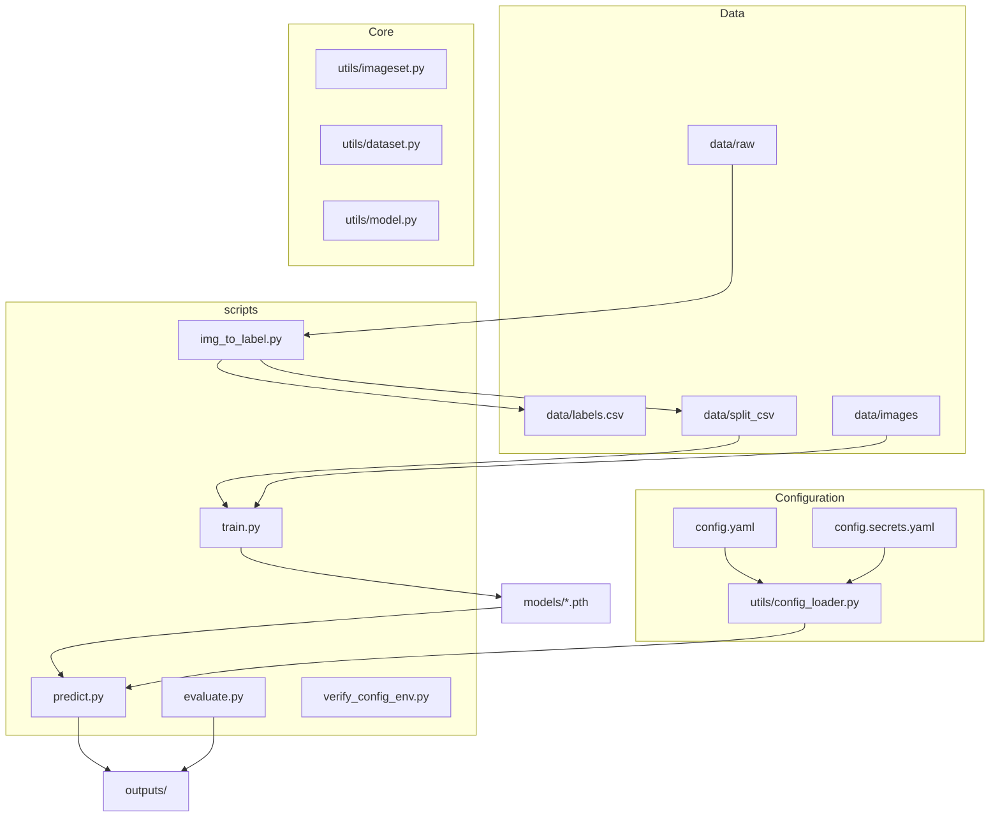
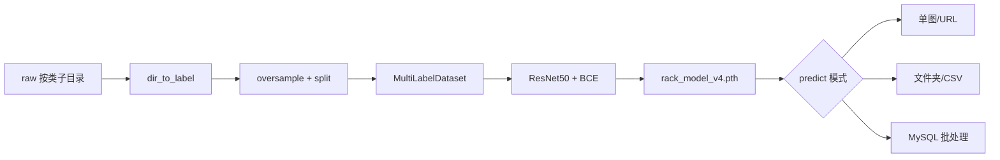

**Language / 语言:** [English](README.md) | [简体中文](README.zh-CN.md)

# cv-shelf-classification

面向零售/巡店场景的**货架拜访照片（visit photo）多标签图像分类**项目。一张图片可同时包含多个类别（如 `RC`、`RP`、`other` 的组合），并非互斥单类分类。技术栈为 PyTorch + torchvision（默认 ResNet50）、scikit-learn 评估指标，并可选通过 MySQL 将预测结果写回业务库。

典型工作流：**原始目录标注 → 划分数据集 → 训练 → 评估/ROC → 生产批预测**。训练、评估与预测脚本位于 [`scripts/`](scripts/)，核心逻辑在 [`utils/`](utils/)；`predict.py` 通过 [`utils/config_loader.py`](utils/config_loader.py) 加载配置，而 `train.py`、`evaluate.py`、`img_to_label.py` 仍使用相对路径 `../config.yaml`，**请在 `scripts/` 目录下执行这些脚本**。

---

## 为什么使用本项目

- **多标签 + 类别不均衡**：[`utils/imageset.py`](utils/imageset.py) 支持 `oversample_minority`、`compute_pos_weight_from_csv`；训练使用 `BCEWithLogitsLoss(pos_weight=...)` 缓解正负样本不平衡。
- **端到端脚本链**：`img_to_label.py` → `train.py` → `predict.py` → `evaluate.py`，业务参数集中在 [`config.yaml`](config.yaml)。
- **生产集成**：`predict_from_mysql()` 从业务表拉取待处理记录，经 `build_resource_url()` 拼接图片 URL，批量推理后将 JSON 结果写回数据库（见 [`scripts/predict.py`](scripts/predict.py) 约 109–227 行）。
- **多环境配置**：支持 development / testing / production；MySQL 密码不入库，通过 `config.secrets.yaml` 或 `RACK_MYSQL_PASSWORD` 注入。
- **可复现评估**：`evaluate.py` 输出 classification report，并生成 `outputs/roc_curve.png`。

---

## 架构

### 模块与目录



### 训练与推理数据流



---

## 工作原理

### 标注与数据

`dir_to_label` 从 `data/raw/<class>/` 扫描子目录，生成 [`data/labels.csv`](data/labels.csv)。`split_dataset` 划分出 `data/split_csv/` 下的 `train.csv`、`val.csv`、`test.csv`，并可复制测试集图片。训练阶段 [`MultiLabelDataset`](utils/dataset.py) 对图像做随机翻转、旋转与 `ColorJitter` 等增强。

### 模型与损失

[`MultiLabelClassifier`](utils/model.py) 将 backbone 末层替换为 `num_classes` 维输出；前向经 Sigmoid 得到概率。训练脚本对原始 logits 使用 `BCEWithLogitsLoss`（可带 `pos_weight`）；验证集 F1 用于选取最佳 checkpoint，权重保存至 `config.yaml` 中的 `model.save_path`（默认 `models/rack_model_v4.pth`）。

### 推理与阈值

推理时对 logits 做 `sigmoid`，再与 `predict_threshold`（默认 **0.6**，见 `config.yaml`）比较得到二值标签。MySQL 批处理模式通过 `get_mysql_connect_kwargs()` 连接当前激活环境对应的数据库，并按业务表结构更新预测字段。

---

## 快速开始

### 环境与安装

```bash
cd /path/to/cv-shelf-classification   # 替换为你的克隆路径
pip install -r requirements.txt
cp config.secrets.example.yaml config.secrets.yaml   # 本地 MySQL 时需要
```

> **注意**：`requirements.txt` 末尾含可编辑安装行 `-e g:\www\python_www\cv-shelf-classification`，请按本机路径修改或删除该行后再安装。

### 数据准备 → 训练 → 评估

以下命令均在 **`scripts/`** 目录下执行：

```bash
cd scripts

# 1) 从 raw 生成标签、过采样、划分、复制测试集
python img_to_label.py

# 2) 训练（权重输出至 config 中 model.save_path）
python train.py

# 3) 对测试集预测（需在 predict.py __main__ 中取消 predict_from_csv 注释）
python predict.py   # 默认单图示例；批量模式见下表

# 4) 评估 + ROC（依赖 outputs/test_predictions.csv）
python evaluate.py
```

### 预测模式

与 [`scripts/predict.py`](scripts/predict.py) 中 `__main__` 的四种入口一致：

| 模式 | 说明 | 示例 |
|------|------|------|
| 单图/URL | 默认入口 | `python predict.py` |
| 文件夹 | `predict_folder` | 取消注释：`predict_folder("../data/images_test")` |
| CSV | `predict_from_csv` | 取消注释：`predict_from_csv("../data/split_csv/test.csv")` |
| MySQL | `predict_from_mysql` | 需配置 `RACK_MYSQL_PASSWORD`；取消注释：`predict_from_mysql()` |

环境变量、MySQL 密码与本地配置校验见下文 [配置](#配置)。

---

## 脚本索引

| 脚本 | 作用 | 运行目录 |
|------|------|----------|
| `img_to_label.py` | 生成标注 CSV、过采样、划分、复制测试图 | `scripts/` |
| `train.py` | 训练并保存验证集 F1 最佳模型 | `scripts/` |
| `predict.py` | 单图/文件夹/CSV/MySQL 批预测 | `scripts/` |
| `evaluate.py` | 分类报告 + ROC 曲线 | `scripts/` |
| `verify_config_env.py` | 三环境切换与密码校验 | **项目根** |
| `visualize.py` | 可视化预测概率 | `scripts/` |
| `batch_rename.py` | 批量重命名工具脚本 | `scripts/` |

---

## 项目结构

```
cv-shelf-classification/
├── config.yaml              # 数据/模型/训练/阈值/环境
├── config.secrets.yaml      # 本地密码（gitignore，见 config.secrets.example.yaml）
├── data/
│   ├── raw/                 # 按类别子目录的原始图
│   ├── images/              # 训练/验证用图
│   ├── split_csv/           # train.csv, val.csv, test.csv
│   └── labels.csv
├── models/                  # *.pth 权重
├── outputs/                 # 预测 CSV、报告、roc_curve.png
├── scripts/                 # 可执行入口（多数需 cd 到此目录）
├── utils/                   # dataset, model, imageset, config_loader
└── db/                      # MySQL 辅助（如有）
```

### 已知改进点（文档说明，后续可单独迭代代码）

- `train.py` / `evaluate.py` / `img_to_label.py` 使用 `open('../config.yaml')`，与 `predict.py` 的 `config_loader` 不一致 → 建议未来统一为「项目根执行 + `get_project_root()`」。
- `requirements.txt` 中的可编辑安装路径需按本仓库环境调整，见上文安装说明。

---

## 配置

[`config.yaml`](config.yaml) 存放非敏感项（数据路径、模型、`active_env`、各环境的 `resource_domain` / MySQL 主机等）。密码**不入库**：将 [`config.secrets.example.yaml`](config.secrets.example.yaml) 复制为 `config.secrets.yaml`，和/或设置 `RACK_MYSQL_PASSWORD`。 [`utils/config_loader.py`](utils/config_loader.py) 合并 secrets、解析当前环境，并为 [`scripts/predict.py`](scripts/predict.py) 组装 MySQL 连接与资源 URL（仅 MySQL 批处理模式需要密码）。

当前默认类别（`config.yaml` → `classes`）：`RC`、`RP`、`other`。

### 密码文件

```bash
cp config.secrets.example.yaml config.secrets.yaml   # 已 gitignore
```

各环境密码写在 `environments.<env>.mysql.password`：

```yaml
environments:
  development:
    mysql:
      password: your_dev_password
  # testing / production 结构相同
```

CI 或生产可只设 `RACK_MYSQL_PASSWORD`，无需创建 `config.secrets.yaml`。

### 环境变量与优先级

| 变量 | 必填 | 说明 |
|------|------|------|
| `RACK_ENV` | 否 | `development` \| `testing` \| `production`；未设置 → `config.yaml` 的 `active_env` → `development` |
| `RACK_MYSQL_PASSWORD` | 是* | MySQL 密码；**覆盖所有环境**，高于 `config.secrets.yaml` 与 `config.yaml` 占位符 |

\* `predict_from_mysql()` 需要密码，除非当前环境在 `config.secrets.yaml` 中已填写真实密码。

| 配置项 | 优先级（高 → 低） |
|--------|-------------------|
| 环境名 | `RACK_ENV` → `config.yaml` 的 `active_env` → `development` |
| MySQL 密码 | `RACK_MYSQL_PASSWORD` → `config.secrets.yaml` → `config.yaml` 占位符（`"${RACK_MYSQL_PASSWORD}"` 或 `""`，视为未配置） |

`RACK_ENV` 覆盖 `active_env` 时，[`config_loader`](utils/config_loader.py) 会在日志中说明实际环境。非法 `RACK_ENV` 会抛出 `ValueError` 并列出允许值。

### 各环境（摘要）

| 环境 | resource_domain（示例）              | 典型用途 |
|------|----------------------------------|----------|
| development | `https://resource.example.cn`    | 本地开发 |
| testing | `https://resource-test.example.cn` | 测试联调 |
| production | `https://resource.example.cn`      | 生产 |

主机、端口、库名见 [`config.yaml`](config.yaml) 的 `environments`。

### 一行命令示例

在 `scripts/` 目录下执行 `predict.py`。

| 目的 | Windows（PowerShell） | Linux / macOS |
|------|----------------------|---------------|
| 默认环境 | `python predict.py` | `python predict.py` |
| 测试环境 | `$env:RACK_ENV="testing"; python predict.py` | `RACK_ENV=testing python predict.py` |
| 生产 + 密码 | `$env:RACK_ENV="production"; $env:RACK_MYSQL_PASSWORD="***"; python predict.py` | `RACK_ENV=production RACK_MYSQL_PASSWORD='***' python predict.py` |

### 本地验证（不连 MySQL）

在**项目根目录**运行 [`scripts/verify_config_env.py`](scripts/verify_config_env.py)，校验：

- 默认 / `RACK_ENV=testing` / `RACK_ENV=production` 下 `resource_domain`、`mysql.host`、`build_resource_url()` 是否正确
- 未配置密码时，各环境是否抛出预期 `ValueError`

```bash
python scripts/verify_config_env.py
```

成功时应看到 `全部验证通过。`

### 常见报错

| 情况 | 说明 / 处理 |
|------|-------------|
| 未配置密码（如 `predict_from_mysql()`） | `ValueError: 未配置 <环境名> 的 MySQL 密码，请设置 RACK_MYSQL_PASSWORD 或 config.secrets.yaml` — 设置环境变量或为该环境填写 `config.secrets.yaml` |
| 非法 `RACK_ENV` | `ValueError: 无效环境 '…'，允许值: development, production, testing` |
